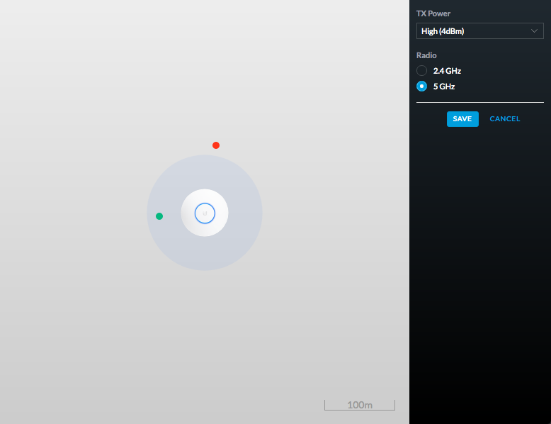

# Unifi SDN - Simple Wi-Fi coverage generator

## Requirements
  - Use React (recommend using create-react-app)
  - Use Redux if you see fit
  - Follow the design in design.png as closely as possible

## Application
  - add 'Coverage Simulator' page with two panels
    - right panel has constant width
    - left panel adapts to screen size
  - draw access point and make it draggable
    - link unmodified [image](https://unifi-hd.ubnt.com/5b30823e7da7b814bb226a9fc0802a19.png) as a resource
    - coverage area (ring around AP) is rgba(68, 137, 244, 0.4)
  - implement simple config panel for AP
    - tx power options: 
      high: 4dBm
      med: -6dBm
      low: -16 dBm
    - radio options: 
      - 2.4 GHz
      - 5 GHz
  - save button should apply changes to coverage calculator
  - cancel button restore previous values
- draw and generate 10 clients (receivers):
  - all are represented by dots
  - initial position is random
- calculate and draw coverage in 2D:
  - clients within range of signal -80dBm should be green
  - other clients should be red
  - coverage area should represents signal -80dB  
  - use https://en.wikipedia.org/wiki/Free-space_path_loss with configured TX power and radio frequency of Access Point
  - to simplify task please assume that:
    - Access Point uses omnidirectional antenna
    - there is no power loss on transmitter antenna
    - client (receiver) has antenna with 1dBm gain   

